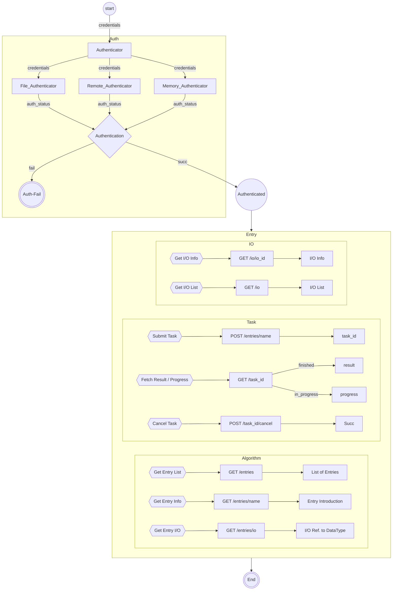
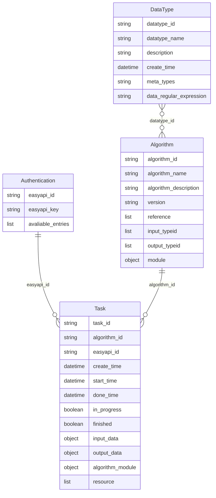

 

# EasyAPI Framework Design

`UPDATED: 2024/10/12, JIARUI LI`

## Service Logic Flow

## Entity Relationship

## API Entries
|Module   |Entry URI   |Method   |Description|
|:--------|:-----------|:--------|:----------|
|Algorithm|`/entries`  |`GET`    |Get the list of all accessible algorithms|
|Algorithm|`/entries/{entry}`  |`GET`    |Get the description of the `entry`|
|Algorithm|`/entries/{entry}/name`  |`GET`    |Get the name of the `entry`|
|Algorithm|`/entries/{entry}/version`  |`GET`    |Get the version of the `entry`|
|I/O|`/entries/{entry}/io`  |`GET`    |Get the I/O data type reference ID of the `entry`|
|I/O|`/types/{io_id}`  |`GET`    |Get the I/O type description by `io_id`|
|I/O|`/types/{io_id}/name`  |`GET`    |Get the I/O type name by `io_id`|
|Task|`/entries/{entry}`  |`POST`    |Create the task submitted to `entry`|
|Task|`/task/{task_id}/cancel`  |`POST`    |Cancel the task `task_id`|
|Task|`/task/{task_id}`  |`GET`    |Get the task `task_id` progress or results|